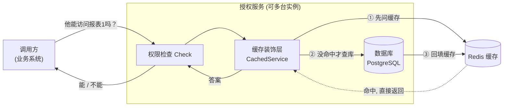
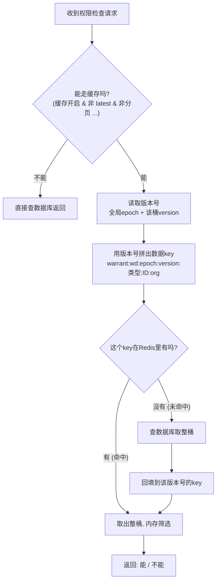
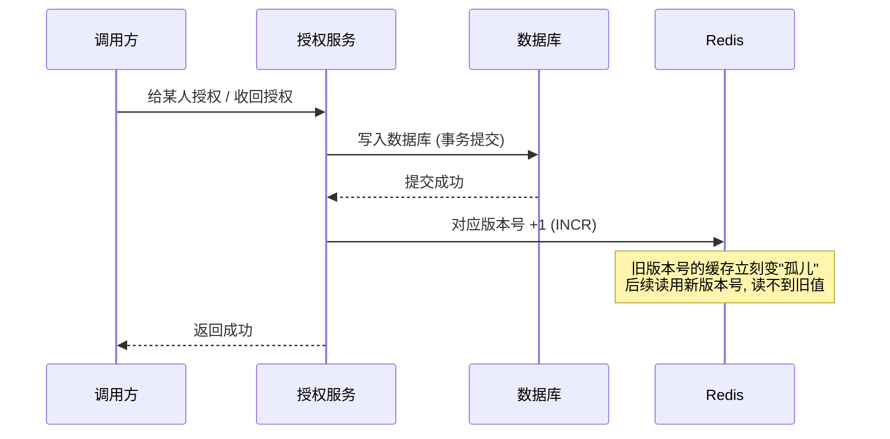
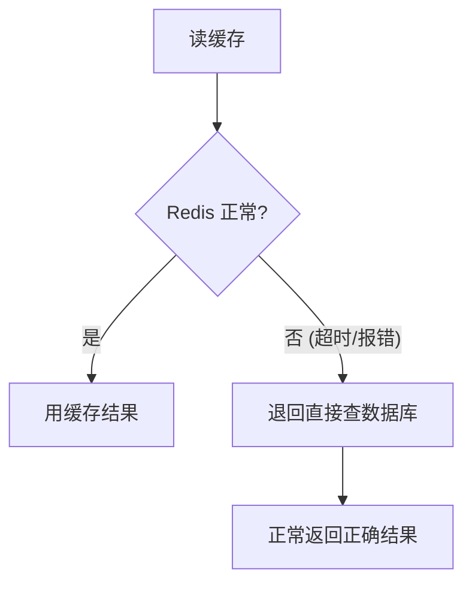

# 授权服务读缓存方案设计

> 目标读者：研发、运维，以及**不了解技术细节但想搞懂"这套缓存到底靠不靠谱"的同学**。
> 全文尽量用大白话 + 类比 + 图表说明。

---

## 1. 一句话概述

我们给授权服务（warrant）的"**查询是否有权限**"这条高频读路径，加了一层 **Redis 缓存**。
它的最大特点是：**即使多台机器同时跑，也几乎不会读到"已经被改掉的旧授权"**（业内叫"零脏读"）。

---

## 2. 为什么要加缓存？（背景）

授权服务是最底层、最核心的服务：几乎**每个请求**都要先问它一句"这个人能不能干这件事？"。

- 不加缓存：每次都去数据库查 → 数据库压力大、响应慢。
- 加缓存：把查过的答案先记在 Redis 里，下次直接拿 → **快、省数据库**。

但缓存有个经典难题，也是本方案的核心：

> **授权被改了（比如刚把某人的权限收回），缓存里还存着"他有权限"的旧答案，怎么办？**
> 如果读到旧答案 = **越权**，这是授权系统绝对不能接受的。

---

## 3. 最大的挑战：会不会读到"过期的旧授权"？

先记住一个生活类比 👇

> 🏷️ **超市价签的故事**
> 商品涨价了，但货架上还贴着旧价签，顾客按旧价付款 —— 这就是"脏读"。
> 怎么彻底避免？我们不去"撕掉旧价签"（容易漏撕、来不及撕），
> 而是给每次价格变动一个**新的版本号**，收银台**只认最新版本号的价签**，旧价签自动没人看了。

我们的方案就是这个思路：**不依赖"及时删除旧缓存"，而是让旧缓存"自动失去意义"**。

---

## 4. 核心思想：把"版本号"写进缓存的门牌号

这是整套方案的灵魂，理解了它就理解了一切。

### 普通缓存怎么做（有脏读风险）

```
key  = "warrant:用户A:报表1"
value= "有权限"
```

改了授权后，要去**删除/更新**这个 key。一旦删除失败、或多台机器删除有时间差，就可能读到旧值。

### 我们怎么做（版本号嵌入 key）

我们把一个**版本号**直接写进缓存的"门牌号"（key）里：

```
key  = "warrant:报表1:【版本3】"
value= "...这一桶授权数据..."
```

- 每次有人改了"报表1"相关的授权，我们就把它的版本号 **+1**（变成版本4）。
- 之后所有读取都用**新版本号**去拼 key：`warrant:报表1:【版本4】`。
- 而旧的 `warrant:报表1:【版本3】` 这条数据，**再也没有人会去读它了** —— 它变成了"孤儿"，过一会儿自动被清理。

> 🎯 关键点：**改授权 = 版本号+1**。旧缓存不需要被删，它自动作废。
> 这就从根上避免了"删缓存失败/有延迟导致读到旧值"的问题。

类比：
| 生活场景 | 对应机制 |
|---|---|
| 快递单号，每次重寄换新单号 | 版本号 +1 |
| 你只查最新单号的物流 | 读取永远用新版本号 |
| 旧单号还在系统里，但没人查了 | 旧缓存变孤儿，自动过期 |

---

## 5. 整体架构



要点：
- 缓存是**可选的、可灰度的**：通过独立配置文件开关（见第 14 节），默认关闭。
- 只有**权限检查（Check）这条读路径**会走缓存；后台管理类查询（带分页、要读最新值）不走缓存。
- 缓存**只是加速**：Redis 出任何问题，自动退回直接查数据库，**业务不受影响**（见第 13 节）。

---

## 6. 缓存里到底存了什么？——"桶"的概念

我们不是一条一条地缓存授权记录，而是**按"桶"（bucket）整组缓存**。

- **warrant（授权关系）数据**：以 `(对象类型, 对象ID)` 为一个桶。
  - 例：报表1（`report:1`）相关的**所有**授权行，打包成一桶，整桶存进 Redis。
  - 读取时，先把整桶取出来，再在内存里筛出"这个人、这个动作"对应的那几条。
- **object_type（对象类型定义）数据**：以 `类型名` 为单位缓存（这是一套全组织通用的定义）。

> 为什么按桶？因为这样**一次改动只需让一个桶的版本号 +1**，失效范围清晰、命中率高。

---

## 7. 读流程：一次权限检查是怎么走的



**大白话版**：
1. 先看这次请求能不能用缓存（强一致请求和管理查询不用）。
2. 取出当前"版本号"，用它拼出缓存的门牌号。
3. 门牌号能找到数据 → 命中，直接用。
4. 找不到 → 查数据库，把整桶按**当前版本号**存进 Redis，下次就命中了。

---

## 8. 写流程：改了授权后，缓存怎么更新？

关键：**先把数据库改成功，再让对应的版本号 +1**。



- 改的是**具体某个对象**的授权 → 只让**那一个桶**的版本号 +1（精确失效，影响最小）。
- 改的是**通配符授权**、或**删除了一个对象**（牵连面太广、无法精确定位） → 让**全局版本号**（epoch）+1，相当于一次性让所有 warrant 缓存作废（保守但绝对安全）。

> ⚠️ 即使这一步"版本号+1"因为 Redis 抖动失败了，也只会让缓存在短时间内（到期前）可能给出旧值，
> 且**已经知道自己刚改了什么的调用方**可以用"强一致读"（第 12 节）拿到最新值。系统不会崩。

---

## 9. 全部缓存 Key 清单

所有 key 都带统一前缀（默认 `warrant:`，可配置）。下表中省略前缀。
所有 key 均为**明文拼接、不做 hash**，方便直接在 Redis 里按对象类型 / 对象ID 排查（例如 `KEYS warrant:wd:*:report:*`）。

| Key 结构 | 举例 | 存什么 | 类型 | 过期时间(TTL) |
|---|---|---|---|---|
| `wd:{epoch}:{version}:{objectType}:{objectId}:{orgKey}` | `wd:0:1:report:rpt-100:*\|orgA` | 一个 warrant 桶的整组授权行（JSON） | 数据 | DataTTL（默认 10 分钟） |
| `wv:{objectType}:{objectId}` | `wv:report:rpt-100` | 某个 warrant 桶的版本号（一个整数） | 计数器 | VersionTTL（默认 24 小时） |
| `wepoch` | `wepoch` | 全局 warrant 版本号（一个整数） | 计数器 | VersionTTL（24 小时） |
| `otd:{epoch}:{typeId}` | `otd:0:report` | 一个对象类型的定义（JSON） | 数据 | DataTTL（10 分钟） |
| `oteepoch` | `oteepoch` | 全局对象类型版本号（一个整数） | 计数器 | VersionTTL（24 小时） |

字段解释：
- **epoch**：全局版本号（`wepoch` / `oteepoch` 的当前值），不存在时按 `0` 算。
- **version**：某个 warrant 桶（`wv:...`）的当前值，不存在时按 `0` 算。
- **objectType / objectId**：明文对象类型与对象ID（约定为标识符，正常不含冒号）。
- **orgKey**：该请求可见的组织范围（当前组织 + 通配 `*`）排序后用 `|` 连接，例 `*|orgA`。
  - warrant **数据 key** **含 orgKey**（org 隔离，A 组织和 B 组织各存各的）。
  - warrant **版本号 key** **不含组织**（一次写让该对象在所有组织的缓存一起失效，保守但安全）。

---

## 10. 失效传播规则（什么操作会让哪些缓存作废）

| 触发操作 | 动作 | 影响范围 | 为什么 |
|---|---|---|---|
| 创建/删除**具体对象**的授权 | `wv:{该桶}` +1 | 仅该 `(对象类型,对象ID)` 桶（所有组织） | 能精确定位，最小失效 |
| 创建/删除**通配符**授权（对象ID=`*`） | `wepoch` +1 | **所有** warrant 缓存 | 通配符会出现在很多桶里，无法逐一定位 |
| **删除一个对象**（object） | `wepoch` +1 | **所有** warrant 缓存 | 该对象可能作为"主体"出现在大量授权里，无法枚举 |
| 创建/更新/删除**对象类型**定义 | `oteepoch` +1 | **所有** object_type 缓存 | 类型定义全局通用，且变更极少 |

> 💡 "全局失效"听起来很猛，但这些操作都很**低频**（删对象、改类型定义远少于普通权限检查），
> 用一次全量失效换取"绝对不脏读"，是非常划算的取舍。

---

## 11. 为什么能做到"零脏读"？（关键不变量）

三条规则共同保证了正确性：

1. **写顺序**：永远是"先改数据库（提交），再让版本号 +1"。
   → 版本号一旦变了，说明数据库**一定已经是新值**。

2. **读取永远用最新版本号拼 key**：旧版本号的缓存（孤儿）**不可能再被读到**。
   → 即使有"慢请求"把旧值回填到了旧版本号的 key 上，也没人会用旧版本号去读它。

3. **版本号 key 的寿命（24h）远大于数据 key 的寿命（10min）**：
   → 保证"版本号即使过期归零、重新从 0 开始"时，那些用过的旧数据 key **早就过期消失了**，不会发生"版本号撞号读到老数据"。

> 唯一的理论窗口：从"数据库提交完成"到"版本号+1完成"之间那**不到 1 毫秒**，
> 且只对"和这次改动毫不相关的并发读"可能短暂看到旧值；
> 对"知道自己刚改了什么的人"（read-your-writes）是严格一致的。
> 这是不引入分布式事务（成本极高）情况下，能达到的**最强实用保证**。

---

## 12. 需要"绝对最新"时：强一致读

有些场景调用方明确需要读到刚刚写入的最新结果。这时在请求头带上：

```
Warrant-Token: latest
```

服务就会**跳过缓存，直接查主库**，拿到 100% 最新的数据。
（代价是这一次没有缓存加速，但保证最新。）

---

## 13. 容错与降级：Redis 挂了会怎样？

**会自动退回查数据库，业务完全不受影响。** 这是设计的底线。



- 读 Redis 出错 → 当作"没命中"，直接查库。
- 写时"版本号+1"出错 → 记一条错误日志；缓存最多在到期前短暂偏旧，靠 DataTTL 兜底自动收敛。
- 整个缓存可一键关闭（删配置文件或 `enabled: false`），瞬间回到"纯数据库"模式。

---

## 14. 配置说明

缓存配置统一放在主配置 `warrant.yaml` 的 `cache:` 段。**默认 `enabled: false`（关闭）**，对老部署零影响，灰度时改为 `true` 即可。

```yaml
# warrant.yaml 的 cache 段
cache:
  enabled: false          # 灰度开启时设为 true
  address: "localhost:6379"
  username: ""            # Redis 6+ ACL 用户名，没有就留空
  password:
  db: 0
  poolSize: 50
  dialTimeout: 5s
  readTimeout: 1s
  writeTimeout: 1s
  dataTtl: 10m            # 数据缓存寿命（仅兜底淘汰孤儿）
  versionTtl: 24h         # 版本号寿命，必须远大于 dataTtl
  keyPrefix: "warrant:"   # 所有 key 的统一前缀（共享 Redis 隔离 / ACL / 运维清理）
```

| 配置项 | 含义 | 默认值 |
|---|---|---|
| `enabled` | 是否启用缓存 | `false` |
| `address` | Redis 地址 | - |
| `username` / `password` | Redis 认证（ACL） | 空 |
| `db` | Redis 库编号 | `0` |
| `poolSize` | 连接池大小 | `50` |
| `dialTimeout` | 连接超时 | `5s` |
| `readTimeout` / `writeTimeout` | 读/写超时 | `1s` |
| `dataTtl` | 数据 key 寿命 | `10m` |
| `versionTtl` | 版本号 key 寿命（须 ≫ dataTtl） | `24h` |
| `keyPrefix` | key 统一前缀 | `warrant:` |

---

## 15. 可观测性：日志

缓存的**读、写关键路径都有 `Info` 级别日志**，默认 `logLevel: 1`（Info）即可看到，便于定位问题。

| 日志（节选） | 含义 |
|---|---|
| `cache: GetCounters ok` | 读到了版本号 |
| `cache: GetBytes ok` (hits=1) | 命中缓存数据 |
| `cache: warrant bucket HIT` | warrant 桶命中 |
| `cache: warrant bucket MISS (refilled from DB)` | 未命中，已从数据库回填 |
| `cache: warrant List bypass (...)` | 本次未走缓存（及原因） |
| `cache: ... invalidate ... (version/epoch bump)` | 发生了一次失效（版本号+1） |
| `cache: invalidate ok (counter incremented)` | 版本号+1 成功，附新版本值 |
| `cache: Incr failed ...` | 版本号+1 失败（Error 级，需关注） |

> 提示：Check 是高频路径，Info 级别下日志量较大，**排查完成后**可调高日志级别（如只保留 Warn/Error）以降噪。

---

## 16. 边界与注意事项

- ✅ **多实例安全**：多台服务实例共享同一套 Redis 版本号，谁写都让版本号+1，所有实例随即用新版本号读取，天然一致。
- ✅ **org 隔离**：warrant 数据 key 含组织范围，不同组织互不串读。
- ✅ **明文 key 便于排查**：可用 `KEYS warrant:wv:report:*`、`KEYS warrant:wd:*:report:rpt-100:*` 直接按对象定位缓存。
- ⚠️ **对象类型按"全局通用"假设**：当前 object_type 缓存不区分组织（业务约定：类型定义全组织共用）。若将来出现"某组织专属的同名类型"，需要把组织维度加回类型缓存 key。
- ⚠️ **`versionTtl` 必须远大于 `dataTtl`**：这是"零脏读"的前提，配置时切勿配反。
- ⚠️ **明文 key 的字符约定**：`objectType` / `objectId` 约定为标识符（不含冒号 `:`），以免破坏 key 结构。
- ⚠️ **共享 Redis 注意 ACL/前缀**：若 Redis 开了 ACL，需放行 `keyPrefix*`（如 `~warrant:*`）以及 `INCR`/`EXPIRE`/`SET`/`MGET` 等命令，否则写失效会报错（如 `EXECABORT`）。

---

## 17. 术语表

| 术语 | 大白话解释 |
|---|---|
| warrant | 一条授权关系，"谁 对 什么 有 什么权限" |
| object_type | 对象类型的定义（有哪些关系、怎么继承） |
| 桶 (bucket) | 把一组相关授权打包在一起缓存的单位 |
| epoch | 全局版本号，+1 = 让某一大类缓存全部作废 |
| version | 某个桶的版本号，+1 = 让这个桶的缓存作废 |
| 孤儿 (orphan) | 旧版本号对应、再也不会被读取的缓存，等它自然过期 |
| 脏读 | 读到了"已经被改掉的旧数据"（本方案要杜绝的） |
| 零脏读 | 几乎不会发生脏读的强一致保证 |
| read-your-writes | "我自己刚改的，我读一定能读到最新" |
| latest | 请求头 `Warrant-Token: latest`，强制跳过缓存读主库 |

---

*本文档描述的是授权服务读缓存的设计原理与使用方式。代码实现见 `pkg/cache/`、`pkg/authz/warrant/cached_service.go`、`pkg/authz/objecttype/cached_service.go`、`pkg/object/cached_service.go`。*
